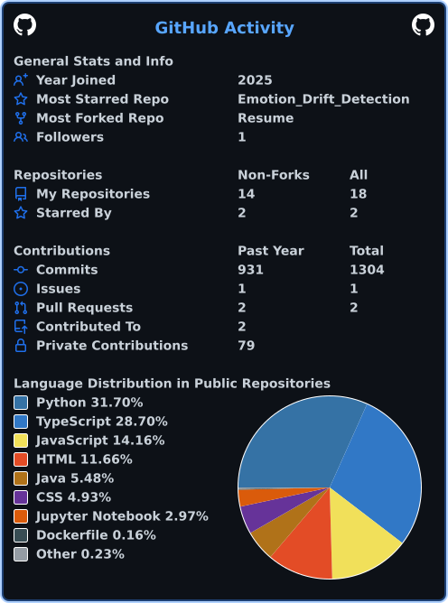

<div align="center">

# Yash Pratap Singh

### AI & Machine Learning Student @ VIT Bhopal | Machine Learning & Computer Vision Developer

<a href="https://github.com/Yash-Singh607">
  
</a>
<a href="https://www.linkedin.com/in/yash-pratap-singh-4542692a0/">
  
</a>
<a href="mailto:yashpratap1837@gmail.com">
  
</a>
<a href="https://leetcode.com/u/yash_014/">
  
</a>

<br><br>


<br><br>

<a href="https://github.com/Yash-Singh607?tab=followers">
  
</a>
<a href="https://github.com/Yash-Singh607?tab=repositories">
  
</a>

</div>

---

## → About

I am an **AI & Machine Learning student at VIT Bhopal University** focused on building practical, reliable AI systems. My interests span **Machine Learning, Deep Learning, Computer Vision, Medical AI, NLP, Edge AI, and software engineering**. I enjoy turning ML research ideas into usable products through clean APIs, modular architectures, model optimization, and thoughtful product engineering.

**Open To:** AI/ML Engineering • Software Engineering • Computer Vision • Applied AI • Research & Development

---

## → Education

**B.Tech — Artificial Intelligence & Machine Learning**  
VIT Bhopal University

---

## → Tech Stack

### Languages
<p>

</p>

### AI / ML
<p>

</p>

**Libraries & Systems:** Scikit-learn • Hugging Face • ChromaDB • Neo4j • Grad-CAM • CLAHE • Optical Flow

### Frontend
<p>

</p>

### Backend & APIs
<p>

</p>

### Cloud / DevOps / Tooling
<p>

</p>

**Cloud / Edge:** Cloudflare Workers • NVIDIA Jetson • CUDA • TensorRT

---

## → AI/ML Expertise

| Domain | Proficiency | Details |
|---|---|---|
| Machine Learning | Strong | Model development, evaluation, transfer learning and applied ML |
| Deep Learning | Strong | PyTorch, TensorFlow, CNNs, transformers and model optimization |
| Computer Vision | Strong | OpenCV, image preprocessing, Grad-CAM, optical flow and real-time CV |
| Medical AI | Strong | Chest X-ray analysis, DICOM workflows and explainable predictions |
| NLP | Intermediate | Transformer-based text classification and emotion analysis |
| Edge AI | Intermediate | NVIDIA Jetson, CUDA, TensorRT and low-latency inference |
| RAG | Learning | Embeddings, vector databases, chunking, retrieval and RAG pipelines |
| Generative AI | Exploring | Exploring LLM-based application development |
| Agentic AI | Exploring | Exploring agent workflows and tool-using AI systems |

---

## → Featured Projects

<details>
<summary><strong>🫁 PulmoScan — AI-Powered Chest X-ray Pneumonia Detection</strong></summary>

An explainable medical-AI pipeline for pneumonia detection from chest X-rays. The system uses transfer learning with **ResNet-50**, image preprocessing, uncertainty estimation and **Grad-CAM** explanations. A **FastAPI** backend exposes REST endpoints for DICOM/image processing and automated PDF report generation, while Docker provides reproducible deployment.

| Area | Details |
|---|---|
| Stack | Python • PyTorch • ResNet-50 • OpenCV • FastAPI • Docker |
| Scale | Image classification and DICOM-compatible inference workflow |
| Performance | 90–94% test accuracy; ROC-AUC 94.2% |
| Explainability | Grad-CAM visualizations |
| Reliability | Uncertainty estimation, automated testing and modular CLI tools |
| Impact | Converts a deep-learning model into an explainable API-driven application |
| Repository | [GitHub](https://github.com/Yash-Singh607) |

</details>

<br>

<details>
<summary><strong>📊 Emotion Drift Detection — Enterprise Sentiment Analytics</strong></summary>

An NLP analytics system designed to track changing customer emotions over time. A fine-tuned **DistilBERT** model processes text while the backend provides secure REST APIs for real-time sentiment analytics. The application supports emotion trajectories, SLA-risk analysis and deployment through cloud and desktop environments.

| Area | Details |
|---|---|
| Stack | Python • DistilBERT • FastAPI • React • Electron |
| NLP | Fine-tuned transformer-based emotion classification |
| Analytics | Emotion trajectory and sentiment-drift analysis |
| Backend | Secure REST API architecture |
| Deployment | FastAPI • Hugging Face Spaces • Docker |
| Impact | Converts individual sentiment predictions into time-aware customer insights |

</details>

<br>

<details>
<summary><strong>🧠 Enterprise Knowledge Copilot — Nasscom Hackathon 2026</strong></summary>

A graph-enhanced enterprise RAG system developed with **Team Runtime Terror**. The architecture combines a vector store with a graph database to support semantic retrieval and relational reasoning. **LangGraph** coordinates the agent workflow while **LangChain** connects retrieval and tools.

| Area | Details |
|---|---|
| Stack | LangGraph • Gemini 1.5 Pro • ChromaDB • Neo4j • LangChain |
| Retrieval | Vector-based document retrieval with ChromaDB |
| Reasoning | Neo4j-based entity and relationship queries |
| Architecture | Document ingestion → embeddings → retrieval → grounded response generation |
| Contribution | End-to-end RAG flow and relational reasoning module |
| Event | Nasscom Hackathon 2026 |

</details>

<br>

<details>
<summary><strong>⚡ Shastra Eye — Real-Time AI Surveillance Pipeline</strong></summary>

An edge-computer-vision pipeline optimized for real-time inference on **NVIDIA Jetson** hardware. The system uses CUDA-based frame buffering and TensorRT FP16 optimization to reduce inference latency while maintaining high-throughput processing.

| Area | Details |
|---|---|
| Stack | NVIDIA Jetson • CUDA • TensorRT • OpenCV • PyTorch |
| Optimization | CUDA multi-threaded frame buffers |
| Inference | TensorRT FP16 quantization |
| Performance | 30+ FPS |
| Latency | Approximately 40% lower latency |
| Impact | Real-time edge AI processing with hardware-aware optimization |

</details>

<br>

<details>
<summary><strong>💡 Visual Stress Detection System</strong></summary>

A computer-vision and biomedical signal-processing system that analyzes facial micro-movements using dense optical flow. The project explores relationships between visual micro-tremors and physiological stress indicators.

| Area | Details |
|---|---|
| Stack | Python • OpenCV • Optical Flow • Signal Processing • Scikit-learn |
| Input | Facial motion captured at 60Hz |
| Method | Dense optical-flow analysis and signal processing |
| Result | 86% correlation with standard HRV indicators |
| Impact | Explores non-contact visual approaches to physiological signal analysis |

</details>

---

## → Experience

### Software Engineering Intern — ShotSelect
**Jul 2026 – Present · Remote**

Contributing to an **AI-powered photo culling platform**, working across backend services and desktop application integration.

- Developed and integrated backend services using **Cloudflare Workers** and scalable REST API design.
- Worked across **React, TypeScript, Electron and Node.js** integration layers.
- Contributed to AI-driven photo-culling functionality and model-driven automated photo selection.
- Debugged integration issues and improved API reliability and performance.
- Collaborated through feature design, sprint planning, code reviews and testing.

**Skills:** Cloudflare Workers • REST APIs • TypeScript • React • Electron • Node.js • AI Product Engineering

---

## → Achievements

| Recognition | Details |
|---|---|
| 🏆 Nasscom Hackathon 2026 | Hackathon participant — Team Runtime Terror |
| 💻 LeetCode | Continuous DSA and problem-solving practice |
| 🤖 Applied AI Projects | Built projects across Medical AI, NLP, Computer Vision and Edge AI |

---

## → Certifications

### Microsoft
- **Introduction to Machine Learning**  
  [Certificate](https://drive.google.com/file/d/1L2iWKByuD2dw5tgzkLo8FALzUMM2-Gf8/view?usp=sharing)

### Vityarthi
- **Fundamentals of Computer Vision**  
  [Certificate](https://drive.google.com/file/d/1BDFinUfZrMvnYod1Pn_A4f0GDVFHE-eM/view?usp=sharing)

### NPTEL
- **Cloud Computing**  
  [Certificate](https://drive.google.com/file/d/1EwffKWtUwqvg5Brd1XNCrUJ-VBlkuWnq/view?usp=drive_link)

### Roadmap.sh
- **Java — Skill Certification**  
  [Certificate](https://drive.google.com/file/d/1HcXIdvpHBQ-SMBKZLkKbHYHHFRNnRCSg/view?usp=drive_link)
- **SQL — Skill Certification**  
  [Certificate](https://drive.google.com/file/d/1Ffjo5XgkENCLzHhkp-4ERpCG0DIBCn-D/view?usp=drive_link)

### Coursera — University of Michigan
- **Applied Machine Learning in Python**  
  [Certificate](https://drive.google.com/file/d/12QZbVBnFK0Lu7rxpOz8mR6GomEF3gY8v/view?usp=drive_link)

### ServiceNow
- **ServiceNow Virtual Internship Program**  
  [Certificate](https://drive.google.com/file/d/1JXZ0capa_y-9H2dGO34-DKONAeRo8Vf/view?usp=drive_link)

### Forage
- **GenAI Powered Data Analytics Job Simulation**  
  [Certificate](https://drive.google.com/file/d/1EaCdWKgVF1YSGhDmvjRF5tOsq3W0x4c2/view?usp=drive_link)

---

## → Coding Profile

<div align="center">

<a href="https://leetcode.com/u/yash_014/">

</a>

</div>

---

## → GitHub Analytics

<div align="center">




<br><br>


</div>

---

## → Contribution Activity

<div align="center">



</div>

---

## → GitHub Trophies

<div align="center">



</div>

---

## → Contribution Snake

<div align="center">

<picture>
  <source media="(prefers-color-scheme: dark)" srcset="./profile/github-snake-dark.svg">
  <source media="(prefers-color-scheme: light)" srcset="./profile/github-snake.svg">
  
</picture>

</div>

---

## → Current Focus

```yaml
Learning:
  - RAG Systems
  - Vector Databases
  - Embeddings & Semantic Search
  - Document Chunking & Retrieval
  - Generative AI

Building:
  - Applied AI/ML systems
  - Computer Vision pipelines
  - API-driven ML applications

Exploring:
  - Agentic AI
  - Advanced RAG architectures
  - Edge AI optimization

Open To:
  - AI/ML Engineering
  - Software Engineering
  - Computer Vision
  - Applied AI
  - Research & Development
```

---

## → Connect

<div align="center">

<a href="mailto:yashpratap1837@gmail.com">

</a>
<a href="https://www.linkedin.com/in/yash-pratap-singh-4542692a0/">

</a>
<a href="https://github.com/Yash-Singh607">

</a>

</div>

---

<div align="center">

> **“Build systems that are intelligent, reliable, and useful.”**

<br>


</div>
